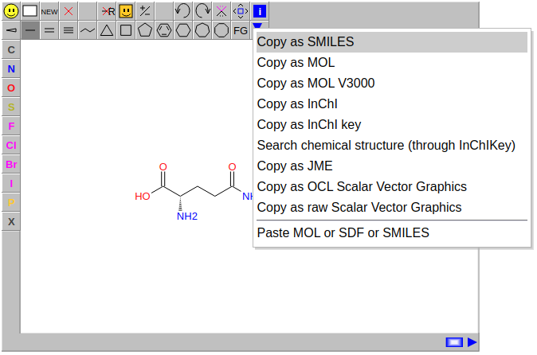

# JSME molecule editor

[![NPM version][npm-image]][npm-url]
[![npm download][download-image]][download-url]

JSME is a free molecule editor written in JavaScript. JSME is a direct successor of the JME Molecule Editor applet.
JSME supports drawing and editing of molecules and reactions on desktop computer, as well as on handheld devices
including iPhone, iPad and Android smartphones and tablets.

## Installation
    npm install jsme-editor

## Homepage
[JSME on github](https://jsme-editor.github.io/)

## Examples
### JSME + webpack (static assets)
[JSME-webpack-example](https://github.com/jsme-editor/JSME-webpack-example)

### JSME in a React component for easy use in React apps
[jsme-react](https://github.com/douglasconnect/jsme-react)

## Publication
[B. Bienfait and P. Ertl, JSME: a free molecule editor in
JavaScript, J. Cheminformatics 5:24 \(2013\)](http://www.jcheminf.com/content/5/1/24)

## License

[3-clause BSD](./license.txt)

[npm-image]: https://img.shields.io/npm/v/jsme-editor.svg?style=flat-square
[npm-url]: https://www.npmjs.com/package/jsme-editor
[download-image]: https://img.shields.io/npm/dm/jsme-editor.svg?style=flat-square
[download-url]: https://www.npmjs.com/package/jsme-editor
